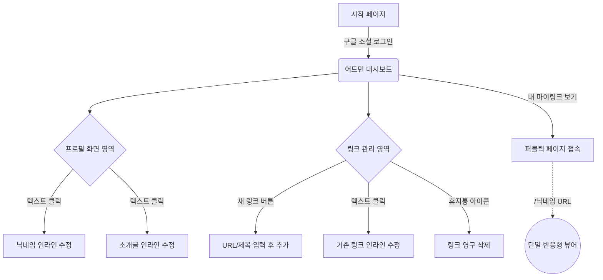

# 마이링크 (MyLink) 와이어프레임

이 문서는 마이링크 서비스의 주요 화면인 **퍼블릭 페이지(단일 뷰어)**와 **어드민(관리자) 페이지**의 UI/UX 구조를 시각화한 문서입니다.

## 1. 화면 흐름도 및 구조 (Mermaid)



## 2. 퍼블릭 페이지 (뷰어) 와이어프레임

마이링크 접속 시 보이는 방문자용 화면입니다 (`/닉네임` URL). shadcn/ui 기반의 카드 스타일 리스트가 화면 중앙 영역에 렌더링됩니다.

```text
+------------------------------------------------+
|                                                |
|             [ 구글 프로필 이미지 ]             |
|                                                |
|               @Nickname (닉네임)               |
|       "Frontend Engineer & Tech Blogger"       |
|                                                |
|                                                |
|  +------------------------------------------+  |
|  | [ 파비콘 ] GitHub                        |  |
|  +------------------------------------------+  |
|                                                |
|  +------------------------------------------+  |
|  | [ 파비콘 ] Velog Blog                    |  |
|  +------------------------------------------+  |
|                                                |
|  +------------------------------------------+  |
|  | [ 파비콘 ] LinkedIn Profile              |  |
|  +------------------------------------------+  |
|                                                |
|                                                |
|                Powered by MyLink               |
+------------------------------------------------+
```

## 3. 어드민 (관리자) 대시보드 와이어프레임

소유자가 로그인했을 때 링크를 관리할 수 있는 메인 페이지입니다. 모든 텍스트 기반 데이터(닉네임, 소개글, 링크 제목, 링크 주소)는 클릭하여 즉시 수정하는 **인라인 편집(Inline Editing)** 방식을 따릅니다.

```text
+-------------------------------------------------------------+
| MyLink Admin                        [로그아웃] [내 마이링크] |
+-------------------------------------------------------------+
|                                                             |
|  ■ 내 프로필                                                |
|  +-------------------------------------------------------+  |
|  | (구글이미지)                                          |  |
|  | 닉네임: [ 인라인 편집 영역 (클릭하여 수정) ✎ ]        |  |
|  | 소개글: [ 인라인 편집 영역 (클릭하여 수정) ✎ ]        |  |
|  +-------------------------------------------------------+  |
|                                                             |
|  ■ 링크 관리                                                |
|  +-------------------------------------------------------+  |
|  | + 새 링크 추가 (URL과 제목을 입력하세요)              |  |
|  +-------------------------------------------------------+  |
|                                                             |
|  ■ 등록된 링크 목록 (총 2개)                                |
|  +-------------------------------------------------------+  |
|  | [파비콘] 제목: [ 인라인 편집 (GitHub) ✎ ]     [삭제]  |  |
|  |          주소: [ 인라인 편집 (https://..) ✎ ] (12 👁) |  |
|  +-------------------------------------------------------+  |
|  +-------------------------------------------------------+  |
|  | [파비콘] 제목: [ 인라인 편집 (Velog) ✎  ]     [삭제]  |  |
|  |          주소: [ 인라인 편집 (https://..) ✎ ] (5 👁)  |  |
|  +-------------------------------------------------------+  |
|                                                             |
+-------------------------------------------------------------+
* 참고: '(12 👁)' 표시는 추후 구현될 각 링크의 클릭 조회수 위치입니다.
```

## 4. UI/UX 레이아웃 정책 정보
- **반응형 처리**: 퍼블릭 페이지 등은 데스크톱 접속 시에도 브라우저 전체 너비를 쓰지 않고, 모바일 최적화 비율(예: `max-w-md`)의 중앙 배치형 UI 컨테이너로 제공됩니다.
- **다이얼로그 및 모달 최소화**: 등록/수정 시 팝업을 띄우지 않고, 화면 내에서 바로 키보드를 입력하여 저장하는 인라인 편집 방식을 유지합니다.
